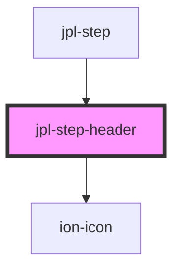

# jpl-step-header

<!-- Auto Generated Below -->

## Properties

| Property       | Attribute       | Description | Type      | Default     |
| -------------- | --------------- | ----------- | --------- | ----------- |
| `active`       | `active`        |             | `boolean` | `undefined` |
| `errorMessage` | `error-message` |             | `string`  | `undefined` |
| `index`        | `index`         |             | `number`  | `undefined` |
| `label`        | `label`         |             | `string`  | `undefined` |
| `optional`     | `optional`      |             | `boolean` | `undefined` |
| `selected`     | `selected`      |             | `boolean` | `undefined` |
| `state`        | `state`         |             | `string`  | `undefined` |

## Dependencies

### Used by

 - [jpl-step](../step)

### Depends on

- ion-icon

### Graph

----------------------------------------------

*Built with [StencilJS](https://stenciljs.com/)*
