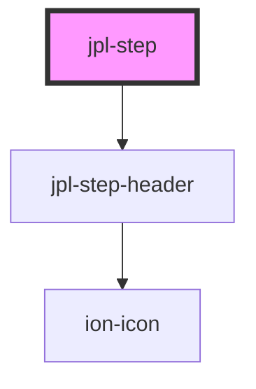

# jpl-step

<!-- Auto Generated Below -->

## Properties

| Property       | Attribute       | Description                                                                                                                                                                                                                                                                                                                                                                                                  | Type      | Default     |
| -------------- | --------------- | ------------------------------------------------------------------------------------------------------------------------------------------------------------------------------------------------------------------------------------------------------------------------------------------------------------------------------------------------------------------------------------------------------------ | --------- | ----------- |
| `errorMessage` | `error-message` | If there was an error, you can display an error message under the step                                                                                                                                                                                                                                                                                                                                       | `string`  | `undefined` |
| `index`        | `index`         | Internal property that displays the step number IF no `state` is added                                                                                                                                                                                                                                                                                                                                       | `number`  | `-1`        |
| `isFirst`      | `is-first`      | Internal property to check if this step is the first step                                                                                                                                                                                                                                                                                                                                                    | `boolean` | `undefined` |
| `isLast`       | `is-last`       | Internal property to check if this step is the last step                                                                                                                                                                                                                                                                                                                                                     | `boolean` | `undefined` |
| `label`        | `label`         | Plain text label of the step                                                                                                                                                                                                                                                                                                                                                                                 | `string`  | `undefined` |
| `optional`     | `optional`      | Syntactically displays a text underneath the label which says "Optional"                                                                                                                                                                                                                                                                                                                                     | `boolean` | `undefined` |
| `route`        | `route`         | Pass a URL the step should route to (this route is added to an href in an anchor tag) For example, say we have a url: https://jpl.nasa.gov For step one we need to pass the `route` attribute: https://jpl.nasa.gov/form/step1 For step two: https://jpl.nasa.gov/form/step2  If you do not add a route attribute, the step will not be active So this is a good way of preventing users from skipping steps | `string`  | `undefined` |
| `state`        | `state`         | Current state of the step. Defaults to 'number'. Available states are: - number (default) - edit (displays pencil icon) - done (displays checkmark icon) - error (displays warning icon)  This property can also intake any Ionicon icon name instead. For example, add the ionicon "add" icon to show a (+) icon                                                                                            | `string`  | `"number"`  |

## Dependencies

### Depends on

- [jpl-step-header](../step-header)

### Graph

----------------------------------------------

*Built with [StencilJS](https://stenciljs.com/)*
